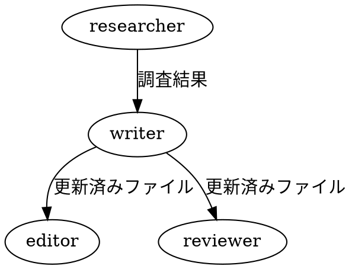

# Article Writers Team

記事の設計ドキュメントをチームでレビュー・更新するワークフロー。

## Team Composition

| Role       | Model  | 責務                                                                     |
| ---------- | ------ | ------------------------------------------------------------------------ |
| researcher | sonnet | 技術用語の裏取り。仕様書・公式ドキュメントとの照合。ファイルは編集しない |
| writer     | opus   | 記事の執筆・更新。CLAUDE.mdのガイドラインに従う                          |
| editor     | sonnet | AI臭さの検出、矛盾点・主張のブレの指摘。ファイルは編集しない             |
| reviewer   | sonnet | 読者目線でのレビュー。ファイルは編集しない                               |

## Workflow



1. **researcher** が技術用語・仕様の裏取りを実施
2. **writer** が調査結果を反映してファイルを更新
3. **editor** と **reviewer** が並行でレビュー（writerの完了後）
4. リーダーがレビュー結果を整理してユーザーに提示し、方針決定後に反映

## Task Setup

TeamCreateでチームを作成し、以下の4タスクを依存関係付きで作成する:

```
Task 1: 技術用語の裏取り → owner: researcher
Task 2: 記事計画の更新 → owner: writer, blockedBy: [1]
Task 3: AI臭さ・矛盾点チェック → owner: editor, blockedBy: [2]
Task 4: 読者目線レビュー → owner: reviewer, blockedBy: [2]
```

## Member Prompts

### researcher

- WebSearch/WebFetchで一次情報（RFC、仕様書、公式ドキュメント）を確認
- 記事中の用語が公式ドキュメントと一致しているか照合
- 具体的な修正提案のリストを作成してSendMessageで報告

### writer

- researcherの調査結果をEditで反映
- プロジェクトのCLAUDE.mdガイドラインを遵守
- 前セッションの決定事項を引き継ぐ（handoverの内容をプロンプトに含める）
- mode: bypassPermissions で起動（ファイル編集のため）

### editor

以下の観点でレビューし、行番号と修正案をSendMessageで報告:

- AIっぽい表現: 同一構文の繰り返し、「〜することができます」の多用、冗長な修飾語
- 矛盾点: セクション間の説明の不整合
- 主張のブレ: 論旨の一貫性
- 断定表現: 仕様で確認できない断定
- 繰り返し: 複数箇所での重複説明

### reviewer

以下の観点でレビューし、セクション単位のフィードバックをSendMessageで報告:

- 前提知識: 対象読者の知識レベルで理解できるか
- 情報の過不足
- セクションの流れの自然さ
- 読後に得られるものの明確さ
- 読み物としての面白さ、離脱ポイント

reviewer の読者ペルソナはプロジェクトごとに変わるため、起動時に指定する。

## Shutdown

全レビュー完了後:

1. 完了したメンバーから順にshutdown_requestで終了
2. 全メンバー終了後にTeamDeleteでクリーンアップ
